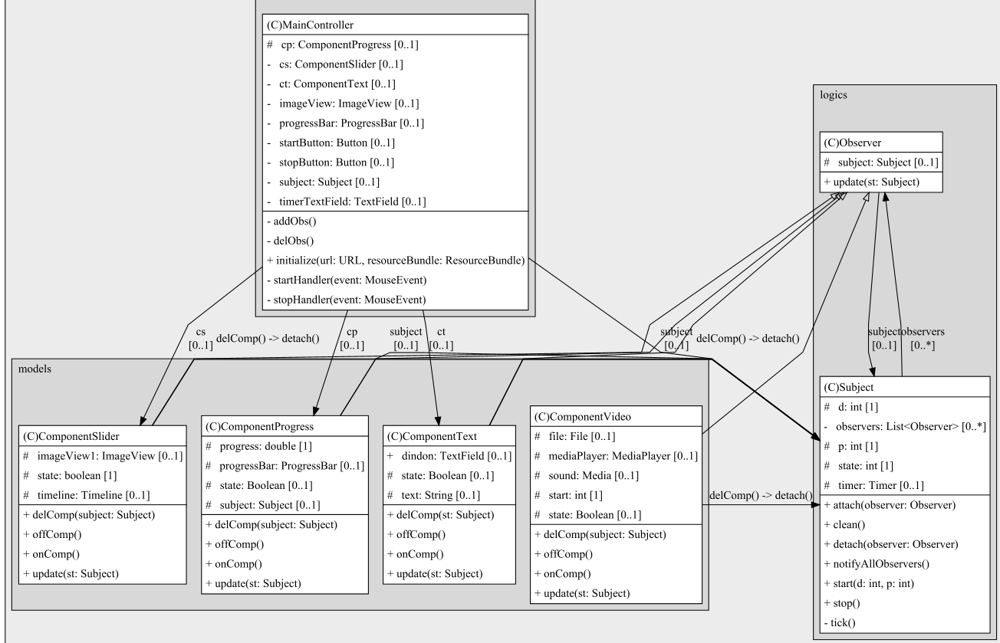

# Task7 | Наблюлатель
## Условия задачи
Требуется реализовать программу в которой одни объект - выполняет некоторую задачу, а три другие отслеживают его состояния для реализации собственной функциональности выбраны следующие:
- Таймер
- Слайдер
- Видеоплеер

## Теоретическая справка
Паттерн Наблюдатель (Observer) определяет зависимость "один-ко-многим" между объектами так, что при изменении состояния одного объекта все зависящие от него объекты уведомляются и обновляются автоматически.
## Диаграмма классов

## Результат

